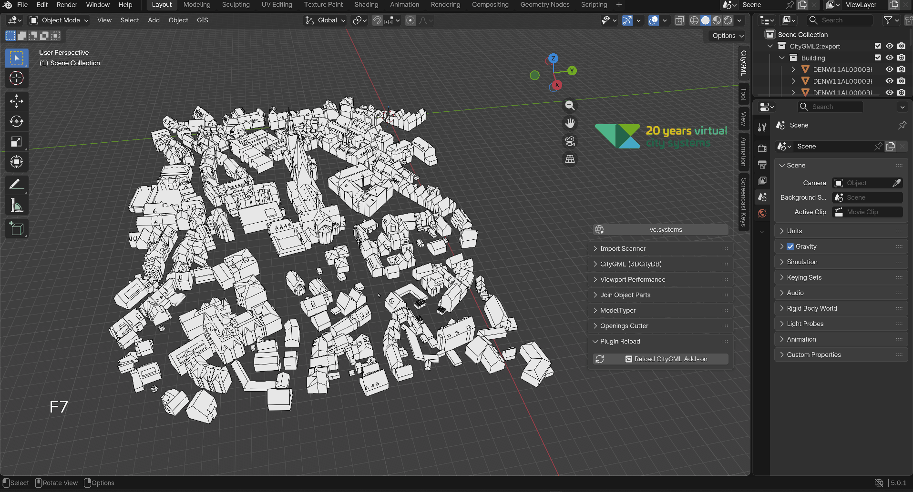
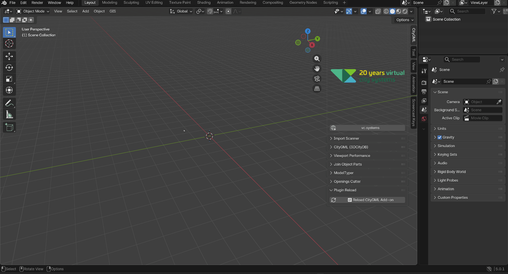

<a id="english"></a>

# 🇬🇧 English

---

# VCS 3DCityDB Importer/Exporter – Blender Add-on

A Blender add-on for importing and exporting **CityGML 2.0** and **CityGML 3.0** files, as well as for direct integration with the **3DCityDB** (v4 and v5).

Developed by [Virtual City Systems](https://vc.systems/en/).

<a id="Table of Contents"></a>

## Table of Contents

- [English](#english)
  - [Features](#features)
  - [System Requirements](#system-requirements)
  - [Installation](#installation)
    - [Download the add-on](#1-download-the-add-on)
    - [Install in Blender](#2-install-in-blender)
    - [Configure add-on settings](#3-configure-add-on-settings-optional)
  - [Usage](#usage)
    - [Import a CityGML file](#import-a-citygml-file)
    - [Export CityGML File](#export-citygml-file)
    - [3DCityDB Import/Export](#3dcitydb-importexport)
    - [Filters](#filters)
    - [ModelTyper](#modeltyper--semantic-surface-classification)
    - [Openings Cutter](#openings-cutter--create-doors-and-windows)
    - [Join Object Parts](#join-object-parts--merge-parts)
    - [Assign Object Part](#assign-object-part--semantic-building-hierarchy)
    - [Viewport Performance](#viewport-performance)
    - [Headless operation](#headless-operation-cli)
  - [Georeferenced Orthophotos](#georeferenced-orthophotos)
    - [Workflow: CityGML + Orthophoto](#workflow-citygml--orthophoto)
  - [Projektstruktur](#projektstruktur)
  - [Dependencies](#dependencies)
  - [License](#license)

---

<a id="en-features"></a>

## Features

- **CityGML 2.0 & 3.0** Import/Export (`.gml`, `.xml`)
- **3DCityDB Integration** – Import and export data directly from PostgreSQL/PostGIS
  - Automatic version detection (v5 with fallback to v4 Java impexp)
  - Support for `citydb-tool` (v5) and `3dcitydb-tool-v4` (Java)
- **Appearance** – Textures, material colors, and UV coordinates
- **Drag & Drop** – Drag `.gml`/`.xml` files directly into the viewport
- **Filters** – BBox, GML-ID, LOD (0–4), and feature type filters
- **Streaming mode** – for very large files (configurable threshold)
- **XSD Validation** – automatic schema validation after import/export
- **Semantics** – Building Parts, Openings (Doors/Windows), Surfaces (Wall/Roof/Ground)
- **Headless operation** – Control Blender in the background via CLI (see `scripts/headless/`)
- **Presets** – Save and load configurations (e.g., DB connections)
- **ModelTyper** – Semantic classification of building parts

<a id="en-system-requirements"></a>

## System Requirements

| Requirement | Minimum |
|---|---|
| Blender | 4.0+ (recommended: 5.0+) |
| Operating System | Windows 10/11, Linux (x86_64), macOS |
| Python | Included with Blender (3.11+) |
| Java (optional) | JRE 17+ (only for 3DCityDB v4 backend) |

<a id="en-installation"></a>

## Installation

<a id="en-download-addon"></a>

### 1. Download the add-on

The add-on is provided as a ZIP archive.

<a id="en-install-in-blender"></a>

### 2. Install in Blender

1. **Edit → Preferences → Add-ons**
2. Click **Install…** in the top right corner
3. Select the downloaded `.zip` file
4. Enable the **“VCS 3DCityDB Importer/Exporter”** add-on in the list (check the box)

> **Note:** The add-on is extracted to `%APPDATA%\Blender Foundation\Blender\<version>\scripts\addons\` (Windows) or `~/.config/blender/<version>/scripts/addons/` (Linux).

<a id="en-addon-settings"></a>

### 3. Configure add-on settings (optional)

The following paths can be adjusted in the add-on settings:

- **CityBD-Tool executable** – Path to `citydb-tool` (default: included)
- **3DCityDB v4 Java** – Path to `java.exe` and the impexp JAR (optional, for v4 databases)
- **Docker** – Alternatively, the citydb-tool can be started via a Docker container

<a id="en-usage"></a>

## Usage

<a id="en-import-citygml"></a>

### Import a CityGML file

1. **File → Import → CityGML (.gml/.xml)**
2. Select file – the CityGML version is automatically detected
3. Optional: Enable appearance import (textures, materials)

Alternatively: Drag and drop a `.gml` or `.xml` file into the viewport.

<a id="en-export-citygml"></a>

### Export CityGML File

1. **File → Export → CityGML (.gml)**
2. Select target file and CityGML version (automatically detected from the scene)
3. Start export – an optional XSD validation is then performed

<a id="en-3dcitydb"></a>

### 3DCityDB Import/Export

DB Import and DB Export are available in the **Sidebar Panel** (N key → “CityGML” tab):

1. Enter connection details (Host, Port, Database, User, Password, Schema)
2. Configure filters (BBox, feature types, GML IDs)
3. Start import/export

The DB version is detected automatically. For a v4 database, there is an automatic fallback to the Java-based importer/exporter.


<a id="en-filters"></a>

### Filters

Various filters can be combined in the sidebar panel:

| Filter | Description |
|---|---|
| **BBox** | Geographical bounding box (MinX, MinY, MaxX, MaxY) |
| **GML-ID** | Comma-separated list of feature IDs |
| **LOD** | Level of Detail 0–4 (LOD 4 only CityGML 2.0) |
| **Feature Type** | Buildings, Bridges, Tunnels, Vegetation, Water, Transportation, etc. |


<a id="en-modeltyper"></a>

### ModelTyper – Semantic Surface Classification

ModelTyper assigns CityGML-compliant surface types (e.g., WallSurface, RoofSurface, GroundSurface) to mesh surfaces. It is available in the sidebar panel under **CityGML → ModelTyper**.

**Automatic Assignment:**

1. Select objects in Object Mode (or choose a collection)
2. Set the feature type (Building, Bridge, Tunnel, WaterBody, Transportation)
3. Select the CityGML version (2.0 or 3.0)
4. Click **“Assign Surface Types (Auto)”** – the geometry is analyzed and surfaces are automatically classified (roof, wall, ground, etc.)

**FBX, OBJ, GLTF, etc... to CityGML:**


**Custom-property mapping:**

The mapping tool is intended for models from sources without CityGML semantics, such as FBX, OBJ, or glTF. It reads custom properties on the object and on the material currently assigned to each face, then creates a new CityGML-semantic material for every matching face. The exporter can process these materials like imported or manually assigned CityGML surfaces.

**Workflow:**

1. Select objects in **Object Mode** or choose a collection
2. Add a mapping row in **Custom Property Mapping**
3. Enter an object and/or material custom property with an optional value
4. Choose the target Feature Type and Surface Type from the CityGML lists
5. Optionally keep **Copy Source Material** enabled to preserve colors, textures, and existing non-semantic material data
6. Click **Apply Property Mapping**

| Field | Meaning |
|---|---|
| **Object Property / Object Value** | Custom property on the Blender object. If no value is entered, the property only needs to exist. |
| **Material Property / Material Value** | Custom property on the material of the current face. If no value is entered, the property only needs to exist. |
| **Match Mode** | Value comparison mode: `Exact`, `Contains`, or `Regex`. |
| **Case Sensitive** | Enables case-sensitive property-name and value matching. |
| **Feature Type** | Target feature for the object, e.g. `BUILDING`, `BRIDGE`, `TRANSPORTATION`. |
| **Surface Type** | Target semantics for matching faces, e.g. `WallSurface`, `RoofSurface`, `GroundSurface`. |
| **Copy Source Material** | Copies the original material and adds CityGML semantics instead of creating a purely color-coded material. |
| **Overwrite Existing Semantics** | Also overwrites faces whose material already contains CityGML properties. |
| **Remove Unused Materials** | Removes material slots that are no longer used by faces after mapping. |

The first enabled matching mapping row wins. If both object and material criteria are set, both must match. Rows can be prioritized with the arrow buttons.

**FBX mapping example:**

| Object Property | Object Value | Material Property | Material Value | Feature Type | Surface Type |
|---|---|---|---|---|---|
| `asset_type` | `building` | `surface` | `wall` | `BUILDING` | `WallSurface` |
| `asset_type` | `building` | `surface` | `roof` | `BUILDING` | `RoofSurface` |
| `asset_type` | `building` | `surface` | `ground` | `BUILDING` | `GroundSurface` |

For each matching face, the tool creates a new material with `SurfaceTyp`, `surface_type`, `Typ`, `FeatureType`, `gml_polygon_id`, `gml_ring_id`, `con_surface_id`, `gml_multisurface_id`, and `lod`. On the object, `ModelType` is set to the dominant mapped Feature Type.

**Note on generic attributes and custom properties:**

In the **Material Properties** of individual surfaces, the regular Blender **Custom Properties** exist alongside the **Generic Attributes** tab. The regular custom properties can contain both domain attributes and Blender-internal or runtime-related data. These regular custom properties are **not** exported as CityGML generic attributes of the surface. Only the entries stored in the **Generic Attributes** tab are considered for export.

The same principle applies to the **Object Properties**: regular custom properties may also contain Blender-internal or temporary data there. Only the values stored in the **Generic Attributes** tab are exported as CityGML generic attributes of the object.

**Manual assignment:**

1. Switch to **Edit Mode**
2. Select individual faces
3. Select the desired surface type from the dropdown (e.g., WallSurface, Window, Door)
4. Click **"Assign Surface Type (Manual)"**
5. For **Window** or **Door**: Optionally enable the **"Generate Interior Surface"** checkbox – an interior face with reversed winding is automatically created (hole in the parent wall surface)

> **Prerequisite:** Creating openings (Window/Door) via "Assign Surface Type (Manual)" only works correctly when the object already has CityGML semantics – either from a **CityGML import** or from a prior run of **"Assign Surface Types (Auto)"** in the ModelTyper. Without existing metadata (`gml_polygon_id`, `con_surface_id`), the parent-child relationship between wall surface and opening cannot be established during export.

> **LoD note:** When faces receive opening semantics **Window** or **Door** via **"Assign Surface Type (Manual)"**, the LoD of the associated top-level object is automatically promoted to **LoD = 3** so that the opening and its parent object are exported consistently.

> **Note:** Each assigned face gets its own material with a unique `gml_polygon_id` and `gml_ring_id`, ensuring the CityGML export writes correct, unique geometry IDs.

**Analysis:**

Clicking **“Analyze Model”** checks the current surface assignment and displays suggestions for improvement in the console (distribution of types, validation errors, feature type recognition).

> **Tip:** The material color icon next to the buttons preserves existing textures when assigning new surface types.

<a id="en-openings-cutter"></a>

### Openings Cutter – Create Doors and Windows

The Openings Cutter generates CityGML-export-compatible window and door surfaces at the level of a selected reference face. It is available in the sidebar panel under **CityGML → Openings Cutter**.

> **Prerequisite:** The object must already have CityGML semantics (materials with `gml_polygon_id`, `con_surface_id`, etc.) before openings can be created. This metadata is provided either by **CityGML import** or by prior assignment via the **ModelTyper** ("Assign Surface Types (Auto)"). Without this metadata, openings cannot be correctly associated with their parent surfaces during export.

**Three ways to create or identify openings:**

1. **Openings Cutter:** Manually create openings with **F8** as a rectangle or with **F9** as a polygon on a selected reference face
2. **Assign Surface Type (Manual):** Assign the opening semantics **Window** or **Door** directly to existing faces in Edit Mode
3. **Custom Property Mapping:** Automatically identify openings via the mapping table when faces or materials already exist with custom properties that mark them as openings


**Workflow:**

1. In **Edit Mode**, select exactly **one face with a material** (the wall surface where the opening should be placed)
2. Draw the opening:
   - **F8** – Draw a rectangle (click + drag)
   - **F9** – Place polygon points (LMB = point, RMB/Enter = finish, Ctrl+Z = undo)
  - With Blender **snapping** enabled, start, end, and polygon points snap to nearby **vertices** and **edges** of visible mesh/curve geometry; this also supports helper geometry in X-Ray-based workflows
3. In the dialog, select the type: **Window** or **Door**
4. Optionally: Toggle the **"Generate Interior Surface"** checkbox (default: enabled)
5. An exterior opening face is created; when enabled, an additional interior face (inner ring/hole) is generated

**Snapping guide lines with Cube, Shrinkwrap, and Wireframe:**

For evenly spaced window or door rows, a separate helper object can be used as a snapping grid:

1. In **Object Mode**, add a **Cube** and scale it so it slightly encloses the building or the relevant facade area
2. In **Edit Mode**, **subdivide** the cube evenly; the number of subdivisions defines the spacing of the guide lines
3. Add a **Shrinkwrap Modifier** to the cube and set the CityGML/building object as the target
   - **Nearest Surface Point** works well for a general envelope around the building
   - **Project** is useful when the grid should be projected onto a facade from a specific direction
   - A small **Offset** can keep the helper geometry slightly in front of the facade
4. Add a **Wireframe Modifier** after Shrinkwrap to turn the subdivided faces into visible guide lines
5. Keep the helper object visible, optionally enable **In Front** or X-Ray, and set Blender **snapping** to **Vertex** and/or **Edge**
6. Edit the actual CityGML object in **Edit Mode** and place openings with **F8** or **F9**; the Openings Cutter will snap to the vertices and edges of the wireframe grid

The modifiers do not need to be applied as long as they are visible in the viewport. The helper object should not be exported; hide it, delete it, or move it to a non-exported collection after placing the openings.


**What is carried over:**

- Material and textures of the source face
- UV coordinates (affinely interpolated)
- Relevant custom properties (SurfaceTyp, etc.)

> **LoD note:** When openings are created with the Openings Cutter, the LoD of the associated top-level object is automatically promoted to **LoD = 3**.

> **Note:** The Openings Cutter does not cut a boolean opening; it creates the semantic opening surfaces as separate faces in the same mesh.

<a id="en-join-object-parts"></a>

### Join Object Parts – Merge Parts

Join Object Parts inserts material-less mesh parts into touching target meshes that have materials. Useful when separate geometry parts need to be assigned to a building after import.
> **Prerequisite:** The target object must already have CityGML semantics (materials with `gml_polygon_id`, `con_surface_id`, etc.) before parts can be joined. This metadata is provided either by **CityGML import** or by prior assignment via the **ModelTyper** ("Assign Surface Types (Auto)"). Without this metadata, the joined geometry cannot be correctly associated with its parent surfaces during export.
**Workflow:**
1. Switch to **Object Mode**
2. Select the mesh objects without materials that you want to merge
3. **Right-click** in the 3D viewport → select **“Join Object Parts”**
4. The tool automatically searches for touching target meshes (with material/CityGML metadata) and inserts the selected parts there
5. A gml:interior surface (hole) is created at the point of contact between the generated object and the main object
6. The tool asks the user whether it should create an additional ClosureSurface at the point of contact (NOTE: The CityGML-compliant export of ClosureSurfaces has not yet been fully implemented; please refrain from creating ClosureSurfaces for the time being.)

> **Note:** Only meshes without assigned materials are processed. If no touching target mesh is found, nothing happens.

<a id="en-assign-object-part"></a>

### Assign Object Part – Semantic Building Hierarchy

Assign Object Part creates a hierarchical CityGML building structure from separate mesh objects. A building mesh is converted into a container (EMPTY), and additional objects are assigned as **BuildingPart** or **BuildingInstallation**.

**Resulting Outliner structure:**

```
📦 Building_Building  (EMPTY, structure_type="hierarchical")
  ├── 🔶 Building       (MESH, structure_part="outer_shell")
  ├── 🔶 Annex          (MESH, cgml3_feature="BuildingPart")
  └── 🔶 Balcony        (MESH, cgml3_feature="BuildingInstallation")
```

**Workflow:**

1. In **Object Mode**, select the objects to assign (source meshes)
2. Select the target object (building) **last** (= active object)
3. **Right-click → Assign Object Part** → choose type:
   - **BuildingPart** – independent building part (e.g., annex, garage)
   - **BuildingInstallation** – element attached to the building (e.g., balcony, stairs, antenna)

**What happens automatically:**

- If the target is a mesh, an EMPTY is created as the Building container
- CityGML metadata (`gml_id`, `cgml3_feature`, attributes like `measuredHeight`, etc.) migrates from the mesh to the EMPTY
- The original mesh becomes the `outer_shell` (main building geometry)
- Source objects receive `cgml3_feature` and are parented under the EMPTY
- During CityGML 2 export, the hierarchy is correctly written as `<bldg:consistsOfBuildingPart>` or `<bldg:outerBuildingInstallation>` – including geometry, appearance (textures + material colors), and coordinate transformation

**Detach:**

Previously assigned parts can be removed from the hierarchy via **Right-click → Assign Object Part → Detach (make independent)**. The object is promoted to a standalone Building. The `outer_shell` cannot be detached.

> **Note:** The context menu only appears when at least 2 objects are selected and an active object is present.


<a id="en-viewport-performance"></a>

### Viewport Performance

Large CityGML scenes can contain many objects, materials, and textures. Imported objects are therefore shown in **Solid View** by default. This keeps the viewport responsive because Blender does not immediately load and compile all materials, textures, and shaders for **Material Preview**.

The **CityGML → Viewport Performance** sidebar panel provides tools for inspecting only the currently relevant objects with full materials:

- **Material Preview (Selection Only)** switches to Material Preview and simplifies non-selected objects.
- **Local View + Material Preview** shows only the selected objects in Material Preview.
- **Bounds** and **Wire** display non-selected objects in a simplified mode.
- **Hide** quickly hides all non-selected objects.
- **Restore Original** restores the original visibility and display settings and switches back to Solid View.

This makes large models easier to navigate while textures and materials are only evaluated in detail for the selected objects.



<a id="en-headless"></a>

### Headless operation (CLI)

The add-on can be run in the background without a GUI:

```bash
blender --background --factory-startup --addons citygml-importer-exporter \
  --python scripts/headless/headless_cli.py -- import --input file.gml --output result.blend
```

Available subcommands: `import`, `export`, `db-import`, `db-export`

Further details: see `scripts/headless/README.md`

<a id="en-orthophotos"></a>

## Georeferenced Orthophotos

For importing georeferenced orthophotos (aerial images, satellite images) as a background or terrain texture, we recommend the external Blender add-on **[BlenderGIS](https://github.com/domlysz/BlenderGIS)**.

BlenderGIS enables:
- Import of GeoTIFF, World files, and other georeferenced raster formats as a **Plane** (mesh plane with texture)
- Automatic CRS transformation and positioning
- Combination with the CityGML models of this add-on in the same coordinate system

> Last tested with BlenderGIS **v2.2.15**.



<a id="en-workflow-orthophoto"></a>

### Workflow: CityGML + Orthophoto

The order is flexible – you can import either the orthophoto or the CityGML objects first.

1. In BlenderGIS, add the required EPSG code via the **(+)** button in the CRS list and select it
2. Import the CityGML file with this add-on (with georeferencing, not "Local Import")
3. Import the orthophoto via **BlenderGIS → GIS → Import Georaster as Plane** → both layers are automatically aligned

<a id="en-projektstruktur"></a>

## Projektstruktur

```
citygml-importer-exporter/
├── __init__.py              # Add-on Registrierung, Operatoren, UI
├── bundled_deps.py          # Python-Abhängigkeiten (lxml, pyproj)
├── io/                      # CityGML 3.0 Reader/Writer
├── io_v2/                   # CityGML 2.0 Reader/Writer
├── common/                  # Gemeinsame Utilities (CRS, Filter, Version)
├── shared/                  # Geometrie, Materialien, XML-Parsing
├── ops/                     # Blender-Operatoren (Validierung, DB-CLI, etc.)
├── ui/                      # Sidebar-Panels
├── modeltyper/              # Semantische Gebäudeklassifizierung
├── Openings_Cutter/         # Openings (Türen/Fenster) ausschneiden
├── scripts/headless/        # CLI-Skripte für Headless-Betrieb
├── presets/                 # Gespeicherte Konfigurationen
├── Schema/                  # XSD-Schemas für Validierung
├── Python_Module/           # Mitgelieferte Python-Pakete (lxml, pyproj)
├── citydb-tool-1.3.0/      # Mitgeliefertes citydb-tool (EXTERN)
└── 3dcitydb-tool-v4/       # Java impexp für 3DCityDB v4
```

<a id="en-dependencies"></a>

## Dependencies

The add-on includes all necessary Python dependencies:

- **lxml** – XML parsing with XPath and namespace support
- **pyproj** – CRS transformations (EPSG codes)

These are automatically loaded from `Python_Module/` and `python_deps/`, respectively. Manual installation is not required.

<a id="en-license"></a>

## License

MIT License

Copyright © 2026 virtualcitySYSTEMS

Permission is hereby granted, free of charge, to any person obtaining a copy of this software and associated documentation files (the “Software”), to deal in the Software without restriction, including without limitation the rights to use, copy, modify, merge, publish, distribute, sublicense, and/or sell copies of the Software, and to permit persons to whom the Software is furnished to do so, subject to the following conditions:

The above copyright notice and this permission notice shall be included in all copies or substantial portions of the Software.

THE SOFTWARE IS PROVIDED “AS IS,” WITHOUT WARRANTY OF ANY KIND, EXPRESS OR IMPLIED, INCLUDING BUT NOT LIMITED TO THE WARRANTIES OF MERCHANTABILITY, FITNESS FOR A PARTICULAR PURPOSE, AND NON-INFRINGEMENT. IN NO EVENT SHALL THE AUTHORS OR COPYRIGHT HOLDERS BE LIABLE FOR ANY CLAIM, DAMAGES, OR OTHER LIABILITY, WHETHER IN AN ACTION OF CONTRACT, TORT, OR OTHERWISE, ARISING FROM, OUT OF, OR IN CONNECTION WITH THE SOFTWARE OR THE USE OR OTHER DEALINGS IN THE SOFTWARE.
